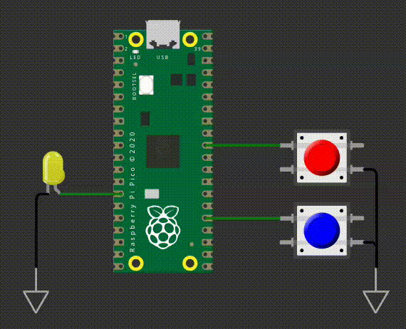

# EXE2

Quando o botão vermelho for pressionado, deve iniciar uma contagem de 1 segundo. Após esse tempo, o LED amarelo deve começar a piscar, indicando o alarme ativado. O alarme deve permanecer ativo, com o LED amarelo piscando, até que o botão azul seja pressionado. Quando o botão azul for pressionado, o alarme deve ser imediatamente desligado, apagando o LED amarelo. Caso o botão azul seja pressionado antes do LED amarelo começar a piscar, o alarme não deve ser ativado e o LED amarelo deve permanecer apagado.

## Regras de implementação do firmware:

- Baremetal (sem RTOS).
- Utilizar timers
- Os leds devem parar de piscar apagados.
- Deve trabalhar com interrupções nos botões.  
- Não é permitido usar `sleep_ms(), sleep_us(), get_absolute_time()`.
- **printf** pode atrapalhar o tempo de simulação, comenta/remova antes de testar.

## Testes

O código deve passar em todos os testes para ser aceito:

- `embedded_check`
- `firmware_check`
- `wokwi`

Caso acredite que o seu código está funcionando, porém os testes estão falhando, preencha o forms:

[Google forms para revisão manual](https://docs.google.com/forms/d/e/1FAIpQLSdikhET4iqFwkOKmgD-G6Ri-2kCdhDLndlFWXdfdcuDfPnYHw/viewform?usp=dialog)
