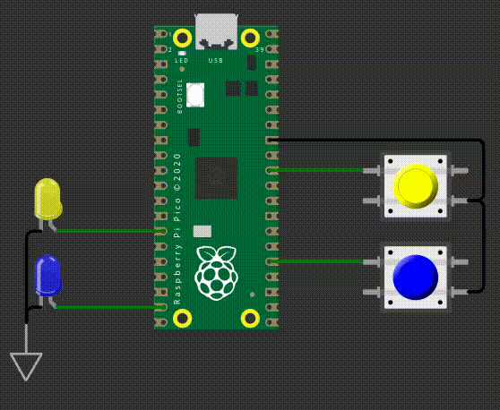
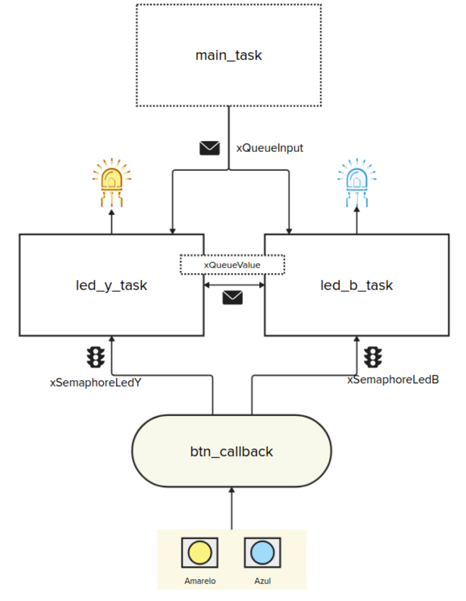

# EXE3

| Funcionalidade | Diagrama |
| ---------------| -------- |
| |  |


Neste exercício, vocês irão utilizar o RTOS para controlar dois LEDs com as seguintes regras:

* A fila `xQueueInput` define quantas vezes os LEDs devem piscar.
* Apenas um LED pisca por vez e ambos os LEDs devem piscar o mesmo número de vezes.
* O botão determina qual LED irá piscar primeiro: o amarelo ou o azul.

  * O callback do botão deve liberar o semáforo correspondente ao LED selecionado.
* A fila `xQueueValue` é utilizada para que a primeira *task* que leu o valor da quantidade de piscadas repasse esse valor para a outra *task*.

### Regras adicionais:

* A fila `xQueueInput` pode receber múltiplos valores.
* Usar delay de `50 ms` para manter os LEDs acesos e de `50 ms` apagados (o teste conta com isso!)

``` text
Exemplo:
        _______         _______
_______|       |_______|       |_____
   50     50      50      50      50    ms
```


#### Exemplo:

Suponha que os valores **5** e depois **2** sejam enviados para a fila `xQueueInput`.

* Se o botão azul for pressionado, a *task* `task_b_led` deverá piscar o LED azul **5 vezes** e repassar o valor **5** para a fila `xQueueValue`.
* Em seguida, a *task* `led_y_task` deverá piscar o LED amarelo **5 vezes**.
* Depois, se o botão amarelo for pressionado, o próximo valor da fila `xQueueInput` (neste caso, **2**) será lido.
* Agora, a *task* `led_y_task` piscará o LED amarelo **2 vezes** e repassará o valor **2** para a fila `xQueueValue`.
* Por fim, a *task* `task_b_led` piscará o LED azul **2 vezes**.

```text
Tempo (ms)  0      500    1000   1500   2000   2500   3000   3500   4000   4500   
            |------|------|------|------|------|------|------|------|------|------|
LED Azul    █░█░█░█░█░───────────────────────────█░█░────────────────────
LED Amarelo ────────────█░█░█░█░█░────────────────────█░█░─────────────
```

Legenda:

* `█` = LED ligado por 50 ms
* `░` = LED desligado por 50 ms
* `─` = LED inativo (não é a vez dele)

## Detalhes do firmware:

- Utulizar RTOS.
- Seguir estrutura proposta do firmware.
- Utilizar período de 500 ms para piscar os LEDs Amarelo e Azul.
- Utilizar período de 100 ms para piscar os LEDs Vermelho.
- **printf** pode atrapalhar o tempo de simulação, comenta antes de testar.

## Testes

O código deve passar em todos os testes para ser aceito:

- `embedded_check`
- `firmware_check`
- `wokwi`

Caso acredite que o seu código está funcionando, porém os testes estão falhando, preencha o formulário:

[Google forms para revisão manual](https://docs.google.com/forms/d/e/1FAIpQLSdikhET4iqFwkOKmgD-G6Ri-2kCdhDLndlFWXdfdcuDfPnYHw/viewform?usp=dialog)
